# Install/uninstall Docker on Ubuntu on Hyper-V:

1: Navigate to start menu and open Hyper-v Manager.

2.1 Select your Linux virtual machine.  
2.2 Click start.

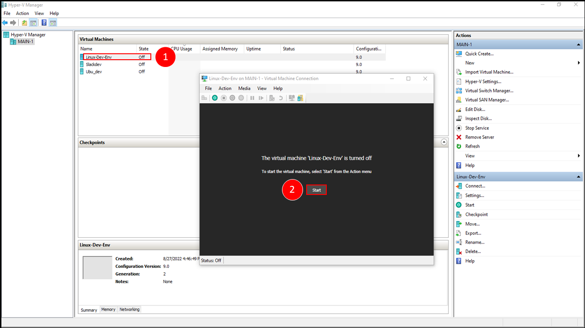
  

3: Open terminal
 

  
4: Run the following command to update package management:

> sudo apt update

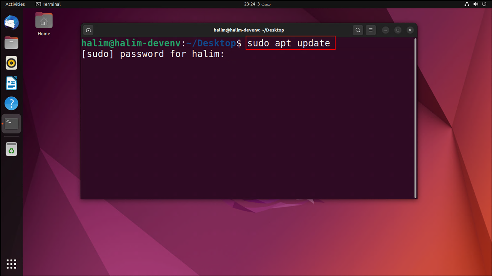

5: Run the following command to Install docker :

> sudo apt install docker.io

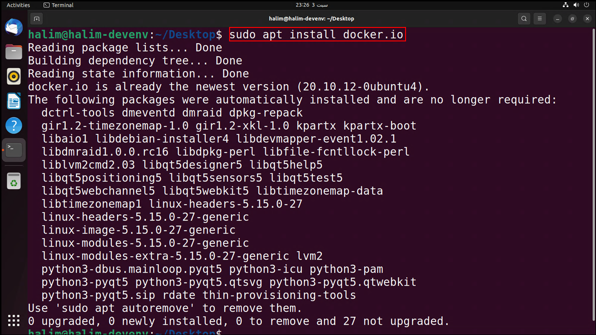

6: You can also remove docker by running the following command:

> sudo apt remove docker.io

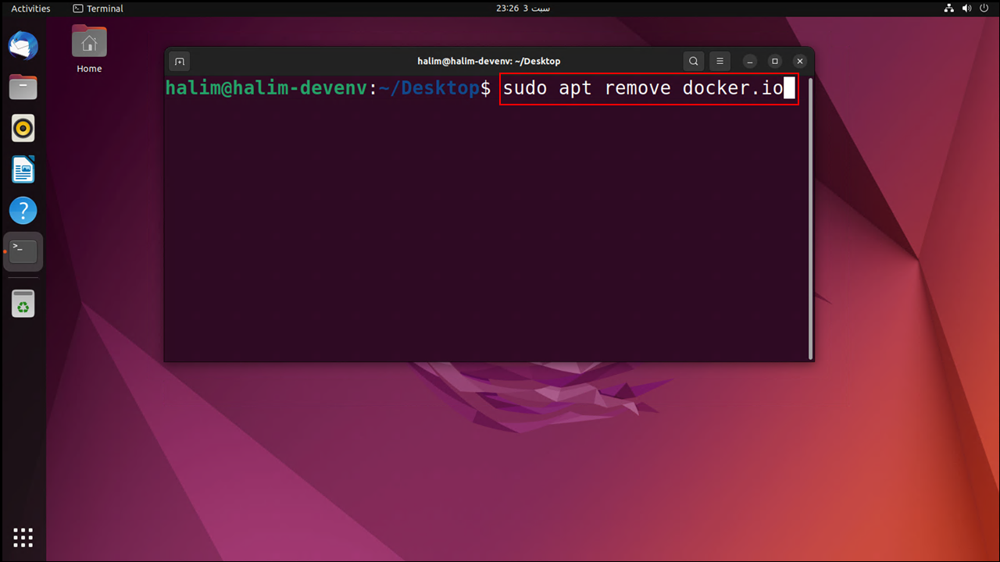

7: Let's download docker again.

> sudo apt install docker.io

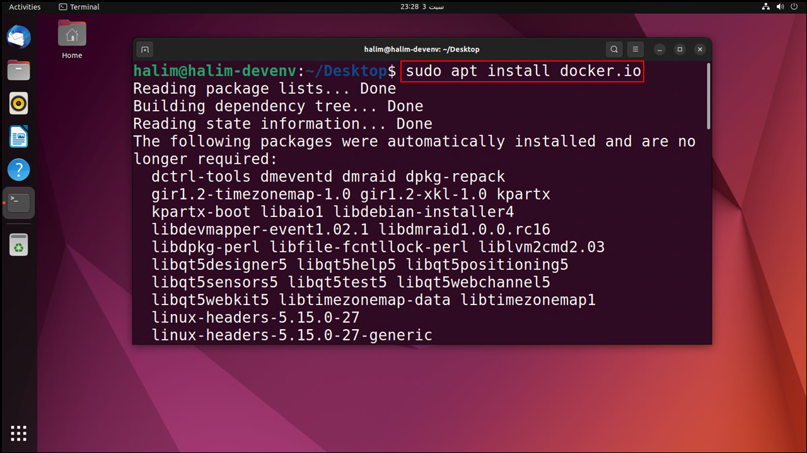

8: Examine Docker Hub:

8.1.1 Navigate to [Docker Hub](http://hub.docker.com/) 
8.1.2 Examine the available images:

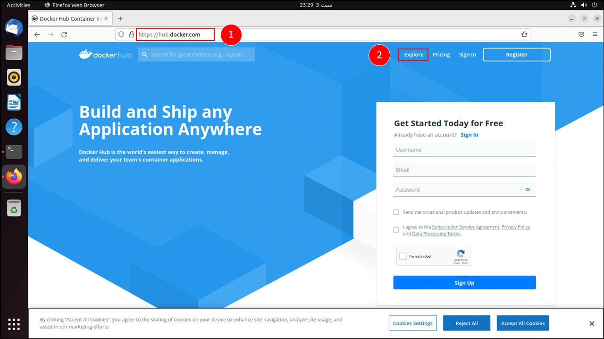

8.2 We will examine 2 examples which are:  
8.2.1: Ubuntu .  
8.2.2: Alpine.  

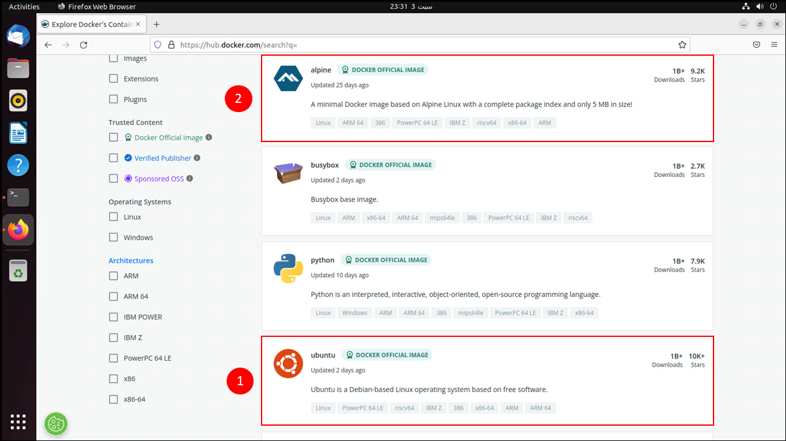

8.3 Navigate to ubuntu you can see the pull command highlighted:
  
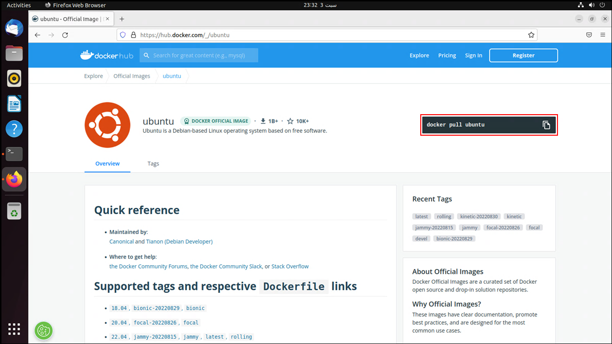
- Let's Pull some images:
  

9: Open terminal window. 
9.1 Run the following command to pull ubuntu and by using the standalone command it will always pull the latest image for any image you're trying to pull: 
9.2 Run the following command to check the images we have inside.

> sudo docker pull ubuntu

> sudo docker images

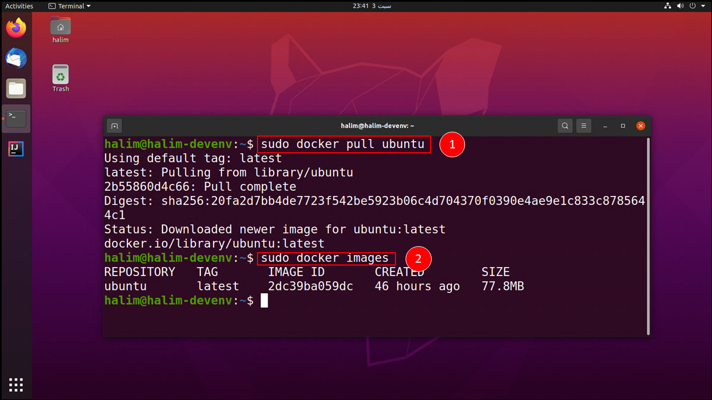

10: Navigate back to alpine page you can see the alpine command.

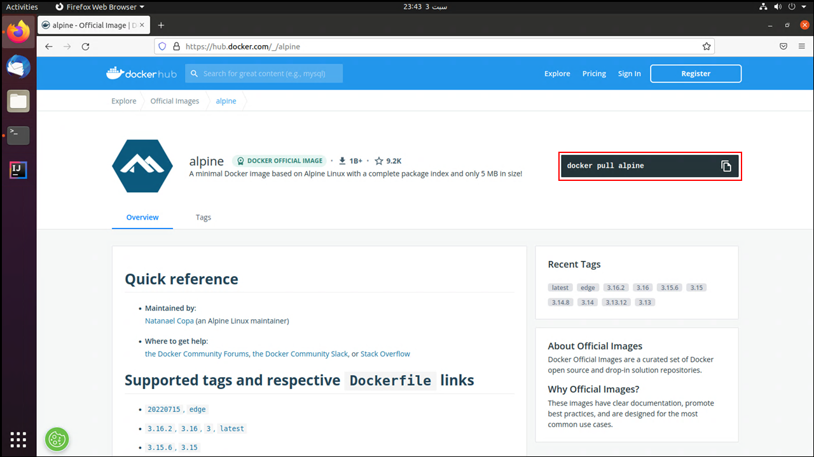

11.1 Run the following command to pull alpine latest image:  
11.2 Run the following command to check the docker images, you can notice we have 2 images (ubuntu that we have pulled earlier and alpine).

> sudo docker pull alpine

> sudo docker images

12.1 But we can pull an image with a specific version it's the same command followed by :then the version you want to pull like the following command for alpine.  
12.2 Run docker images to check all the images, you can notice 3 images 2 with the latest tag and one with the specific tag 3.12.

> sudo docker pull image alpine:3.12

> sudo docker images

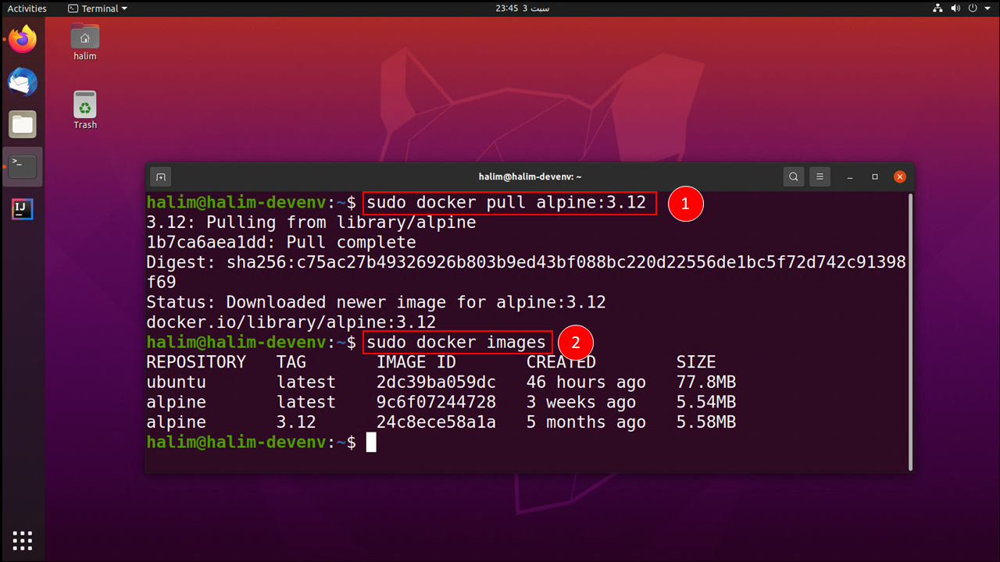

13: Let's Make our first container by running the following command.

> sudo docker run -it --name con-1 ubuntu /bin/bash

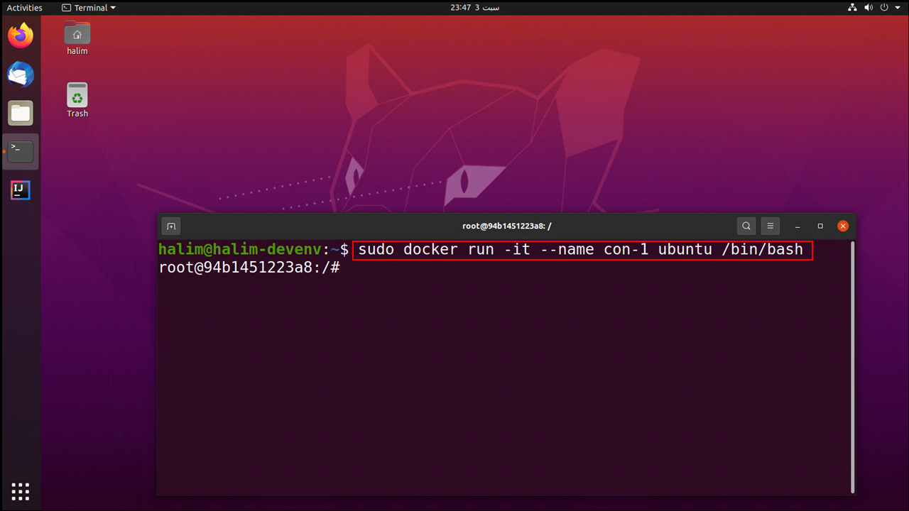

14: Let's Open a new Terminal.  
14.1 Right-click on the highlighted terminal icon.  
14.2 Click new window.  

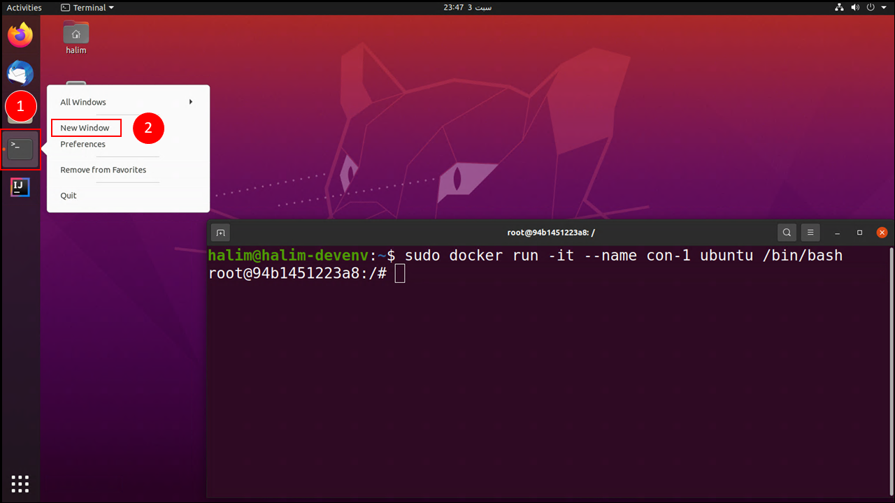

  
15: Run the following command to check the running containers.

> sudo docker ps

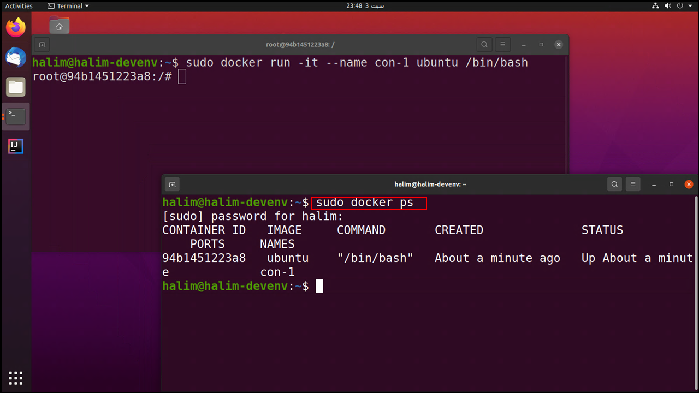

16: Navigate to the first terminal window to exit the container:

> exit

  

17: Navigate to the second terminal to check running containers again:

> sudo docker ps

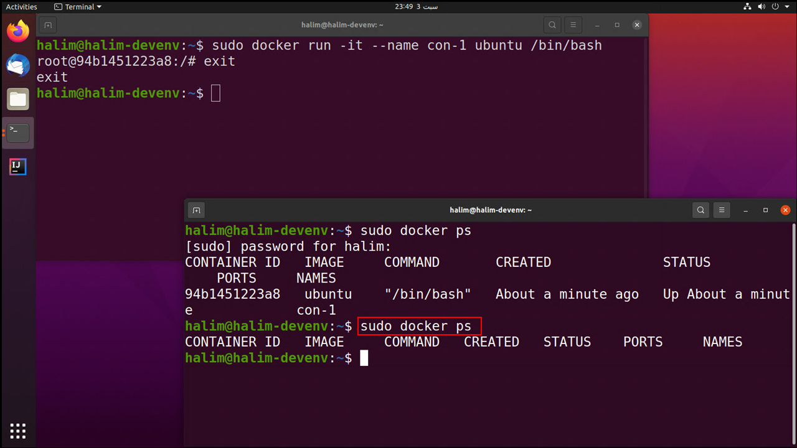

  

18: Navigate to the first terminal to create the second container:

> sudo docker run -it --name con-2 ubuntu /bin/bash

  

19: Navigate to the second terminal to list all containers -a (running and not running) also you can notice that it also detect that container with name con-1 exited about a minute ago.

> sudo docker ps -a

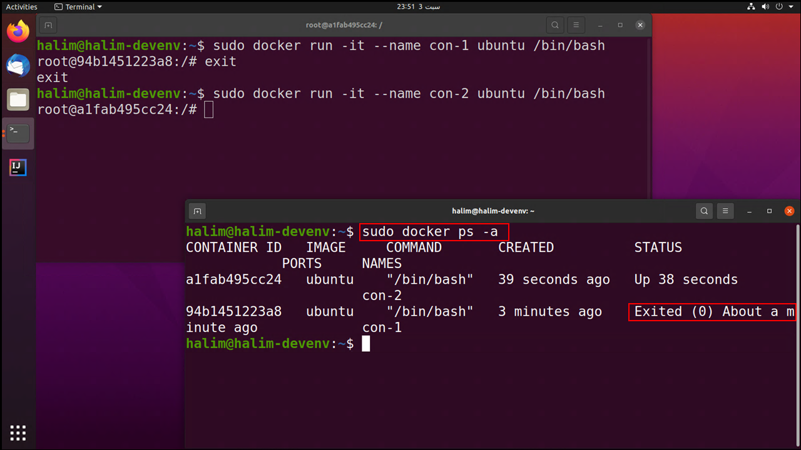

  

20: Navigate to the first terminal and exit the 2nd container.

> exit

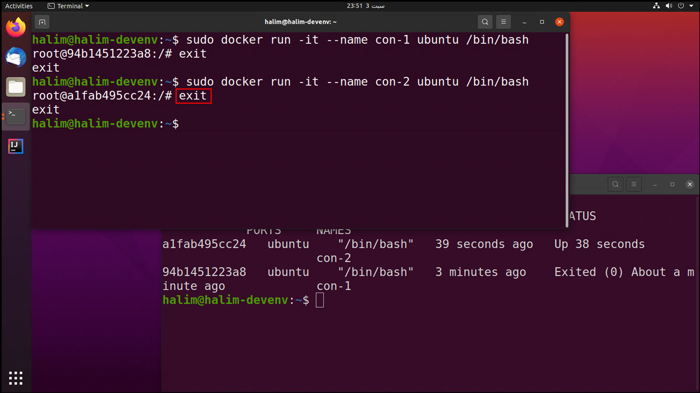

21: Navigate to the second terminal to check running containers.

> sudo docker ps

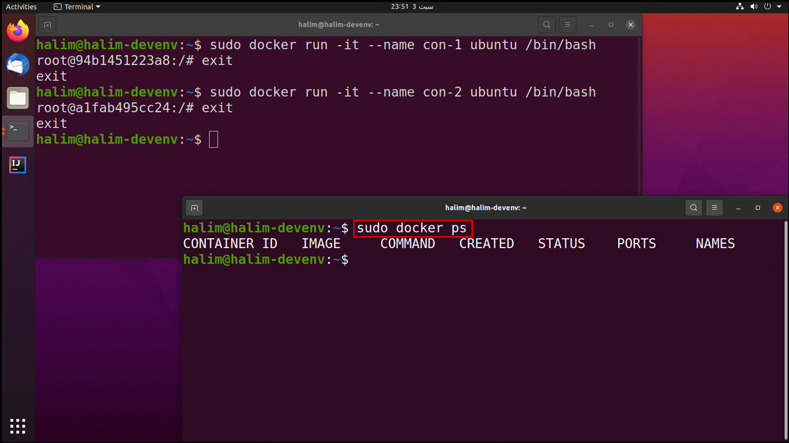